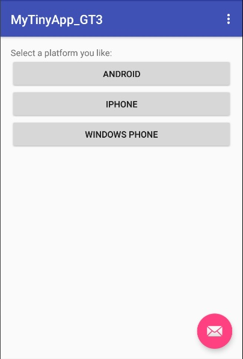
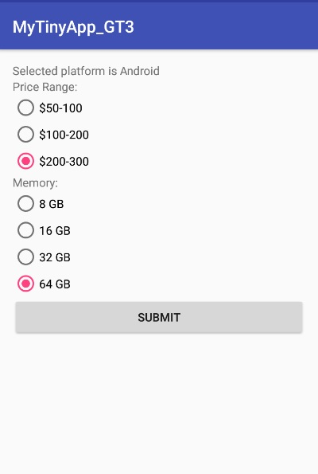

# The Tiny App

This app provide users several options of a mobile phone. After user has selected their options, it will display all the selected options and the icon of the mobile platform they selected.

## Features of the app:
- 3 Activities
- 3 Widgets
- 3 Images
- 3 Screens

## Running requirements:

Android 6.0 (Marshmallow)

## Usage instructions:

- Open the app
- Press a button based on your choice of platform: Android, iPhone, Windows Phone.
- You will be taken to second screen, where you need to select price range and memory.
- When you press submit button, third screen will be shown where you can see information you entered along with platform image.

## What I learned:

- How to use Android Studio
- Using LinearLayout, RelativeLayout
- Using widgets: buttons, radio buttons 
- How to use intents
- How to pass data between different views
- How to deploy your app on the emulator and on the actual mobile

## Resources used

- [Android Documentation - LinearLayout](https://developer.android.com/reference/android/widget/LinearLayout.html)
- [Android Documentation - Intent](https://developer.android.com/reference/android/content/Intent.html)

## Screenshots:

